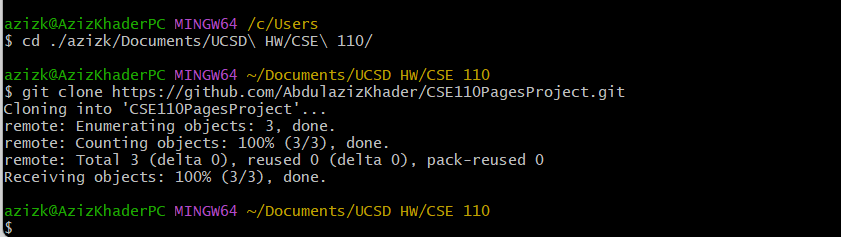
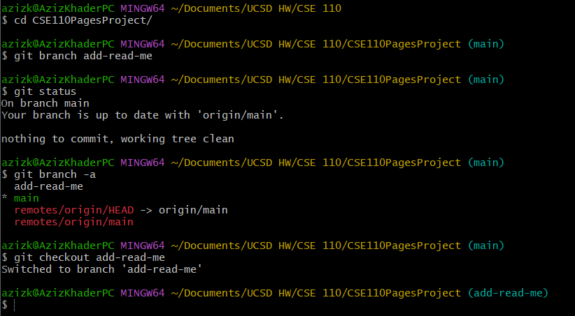
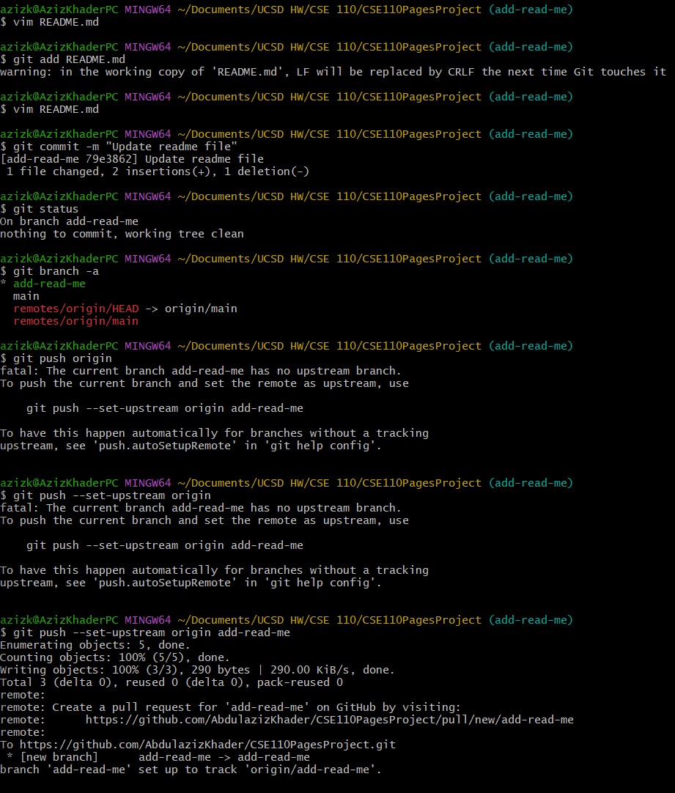
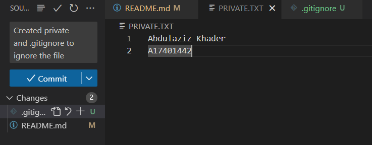

# My Page of Markdowns

## Screenshots of Source Control

### These are the pictures of the commands from Git:


 

This was an **interesting** part of the source control. 

### These are the pictures of the VSCode UI:
 

This took *longer* than expected. ~~I should have switched to Business~~

We can also do math: x<sub>3</sub><sup>2</sup> = 4. As a wise man once said: 
> MATH is M.ath A.llows T.hinking to H.appen

A part of my code is:
```
git add
git commit
git push origin add-read-me
```
